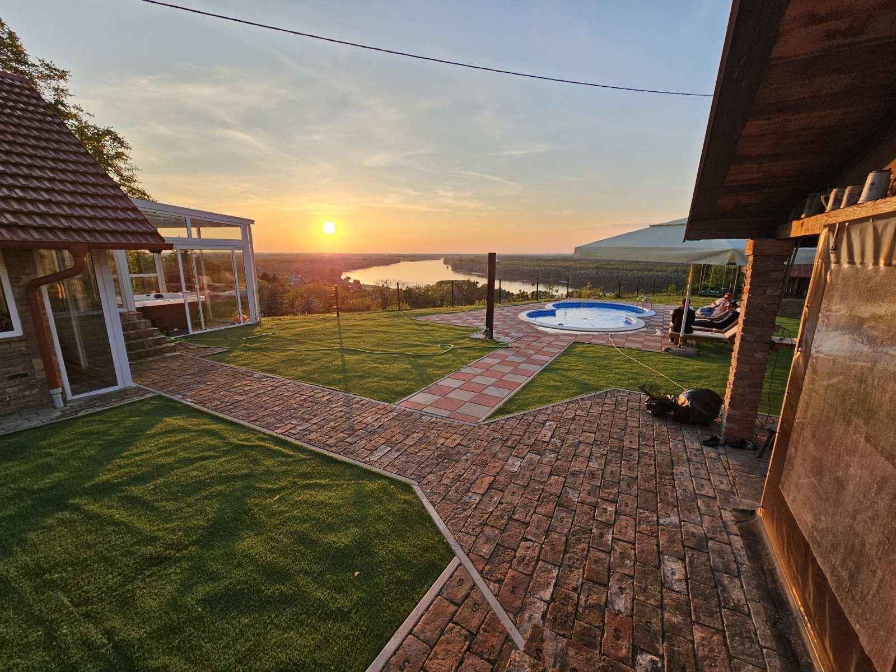

## Panorama House Aljmaš – web prezentacija

Moderni, minimalistički i mobile‑first sajt za smještaj "Panorama House Aljmaš". Izgrađen na Next.js App Routeru uz Tailwind dizajn sistem prilagođen zemljanim tonovima brenda.



### Glavne karakteristike

- ✅ Mobile-first layout sa zajedničkim header/footer komponentama
- ✅ Hero sekcija s CTA za WhatsApp rezervacije i pregled sadržaja
- ✅ Sekcije: O smještaju, pogodnosti, galerija s lightboxom, lokacija s Google Mapom, kontakt preview
- ✅ Posebne stranice `/o-nama` i `/kontakt` s formom (Formspree), kontakt podacima i mapom
- ✅ SEO metapodaci (OpenGraph/Twitter), sitemap, robots, favicon
- ✅ Fokus na pristupačnost i performanse (aria etikete, tastatura, lazy-loaded slike)

### Tehnologije

- [Next.js 15 (App Router)](https://nextjs.org/)
- [React 18](https://react.dev/)
- [Tailwind CSS v4](https://tailwindcss.com/)
- [TypeScript](https://www.typescriptlang.org/)
- [Heroicons](https://heroicons.com/) & [Lucide](https://lucide.dev/)

---

## 🚀 Brzi početak

```bash
npm install
npm run dev
# aplikacija je dostupna na http://localhost:3000
```

Produkcijski build:

```bash
npm run build
npm run start
```

### Preduvjeti

- Node.js 18+ (preporuka 20 LTS)
- NPM (dolazi s Node instalacijom)

### Struktura projekta

```
app/
	layout.tsx          # Globalni layout, header/footer, metapodaci
	page.tsx            # Početna strana
	o-nama/page.tsx     # Detalji o objektu
	kontakt/page.tsx    # Kontakt informacije i forma
	globals.css         # Globalni stilovi, custom util klase
	robots.ts, sitemap.ts, icon.png
components/
	Header, Footer, Hero, Features, Gallery, MapEmbed, WhatsAppCTA, ContactForm...
lib/
	site.config.ts      # Centralni podaci (kontakt, SEO, linkovi)
	utils.ts            # Pomoćne funkcije
public/
	logo.png, images/   # Hero + galerija (9 slika)
```

---

## ✉️ Formspree integracija

Kontakt forma koristi Formspree. Prije deplymenta:

1. Kreirajte besplatni projekt na [formspree.io](https://formspree.io/).
2. Zamijenite `FORM_ENDPOINT` vrijednost u `components/ContactForm.tsx` vašim stvarnim Form ID-jem.
3. (Opcionalno) Dodajte honeypot ili CAPTCHA po potrebama.

Ako preferirate EmailJS ili vlastiti backend, promijenite `handleSubmit` logiku u istoj komponenti.

---

## 🌍 Deploy na Vercel

1. Pushajte repo na GitHub (preporučeno ime: `panorama-house-aljmas`).
2. U Vercel dashboardu odaberite **New Project** → importujte repo.
3. Build komanda: `npm run build`, Output dir: `.next`
4. Postavite custom domenu i provjerite da `/sitemap.xml` i `/robots.txt` rade.

---

## ✅ Kontrolna lista kvaliteta

- Lighthouse mobilni ciljevi: Performance ≥ 90, Accessibility ≥ 95, SEO ≥ 95 (preporuka)
- Provjerite navigaciju (hamburger, ESC zatvaranje, fokus stanja)
- Testirajte WhatsApp CTA na različitim uređajima
- Validirajte kontakt formu (obavezna polja, poruka o uspjehu/grešci)
- Potvrdite da su sve slike optimizirane (`next/image`) i imaju opisne alt tekstove

---

## ℹ️ Dodatne ideje

- Dodati Vercel/GA4 analytics
- Implementirati automatski OG image generator
- Uvesti CMS (npr. Sanity) za dinamičku galeriju i sadržaj
- Dodati `next-sitemap` paket za naprednije upravljanje sitemapom ako se struktura širi

---

Sva pitanja, dorade i prijedloge možete slati na [panoramahousealjmas@gmail.com](mailto:panoramahousealjmas@gmail.com).
